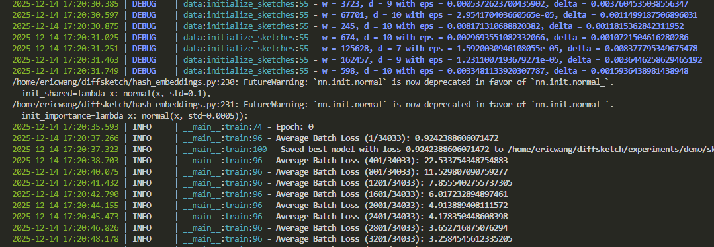

# Learning Based Sketch Parameter Configuration

This repository contains the code for running and experimenting with predicting the parameters for Count-Min sketch using a neural network. For the hash embedding used in this repo, we use the [optimized implementation](https://github.com/YannDubs/Hash-Embeddings) from Yann Dubois.

## Overview

A Count Min sketch is an approximate data structure that lets us track and estimate the frequency of unique keys. In a sense, it is a more memory efficient version of a hash table used for the same purpose (think `Counter` from the Python `collections` library). At a high level, it works by hashing a key with several hash functions and increments multiple separate counters. The minimum value of these counters in expectation can approximate the frequency of the key with bounded error while using sublinear space.

More formally, let $d, w \in \mathbb{N}$, and let $x \in X$ be a key. To increment the count of $x$, we apply several hash functions $h_i: X \rightarrow [w]$, where  $1 \leq i \leq d$, to get the indices in an array of counters $M_i$ (each array is size $w$). We then increment $M_i[h_i(x)]$ by however much $x$ increased. Taking $$query(x) = min_i(M_i[h_i(x)]), \quad 1 \leq i \leq d$$ gives us our frequency estimate. In practice these arrays of counters are represented as a $d \times w$ matrix. While there are good theoretical analyses for choosing $d$ and $w$ to achieve a certain approximation error, these are often too pessimistic for real world data, leading to overly large values of $d, w$. Thus, we investigate whether we can leverage machine learning to find empirical parameters that will minimize space used while still achieving the desired approximation error.

More specifically, we train a neural network to predict the optimal $d, w$  given a key, its approximate frequency information, and a target error rate $\epsilon$. Averaging predictions over multiple keys will let us estimate an optimal $d, w$ for the entire data stream. We find that our predicted parameters can achieve between 58.26-69.70% size reduction while having minimal impact on approximation accuracy. More details on the results can be found in this [slide deck](https://docs.google.com/presentation/d/1w3fIoRlOjpfgxUjItYQohgppemqLPbYHeIJGPBimPkg/edit?usp=sharing). 

## Environment Setup

Make sure that you have a working Python installation (recommended to be at least Python 3.11 for consistent replicability). Install the required dependencies either with pip (`requirements.txt`) or conda (`environment.yml`) like so.
```bash
cd diffsketchparam

# Virtual env/pip installation.
pip install -r requirements.txt

# Conda installation.
conda env create -f environment.yml
```

## Project Structure

The code files for utilities live within the `diffsketch` folder, while `train.py` and `evaluate.py` are the main driver scripts. Other files are either miscellaneous files for fetching data, environment set up, etc.

```text
diffsketchparam/
├── ...
├── diffsketch/
│   ├── model.py
│   ├── config.py
│   ├── data.py
│   ├── sketch.py
│   └── hash_embeddings.py
├── train.py // Train model with this.
├── evaluate.py // Test model by predicting sketch parameters.
└── ...
```

## Preparing the Data

For our experiments, we use packet traces sourced from the **CAIDA Anonymized Internet Traces 2018 Dataset**, collected over the `equinix-nyc` monitor, but it is not important which portion of the dataset you choose to use. To donwload the pcap files, follow the instructions at the following link to create an account and request access: [CAIDA Passive Traces](https://www.caida.org/catalog/datasets/passive_dataset_download/). Once you have created a username and password, you can download the associated pcap files to your system using `wget` like so. Note that the entire dataset is very large (the 2018 dataset alone is nearly 1 TB), so it is recommended to either reserve space in a separate drive or only download select files.

```bash
# Example: Downloading the pcap files from an entire folder 

mkdir caida_data
cd caida_data

# Replace the url with the path to the folder of data you want to download.
wget -np -m https://data.caida.org/datasets/passive-2018/equinix-nyc/20180315-130000.UTC/ -A "*.pcap.gz" --user <USERNAME> --password <PASSWORD>

# The above download mirrors the directory structure of the hosted data.
cd path/to/pcap_dir
gzip -d *.gz
```

### Processing the PCAP Files

Once we have the uncompressed the pcap files, we need to convert them into CSV so that we can process them. We used [**CICFlowMeter**](https://github.com/ahlashkari/CICFlowMeter), but you are free to skip this section and use other tools as well like Wireshark. To build CICFlowMeter, make sure you have an appropriate gradle (we used version 5.1.1) and an appropriate Java installation (at least JDK 11) and run the following.

```bash
# Building the CICFlowMeter (cfm) executable script.

# NOTE: You may have to modify the version of gradle (distributionUrl) in the gradle-wrapper.properties file .
cd gradle/wrapper

# Go back to root of repo.
cd CICFlowMeter
./gradlew build
```

This should produce the `cfm` executable under `build/distributions/CICFlowMeter-4.0/bin/`. Finally, we must make sure that certain native libraries are properly linked. Open the `cfm` script, and change `DEFAULT_JVM_OPTS` to the following.

```bash
# The repo contains precompiled so/dll files for jnetpcap.
library_path="/root/to/repo/jnetpcap/linux/jnetpcap-1.4.r1425"
DEFAULT_JVM_OPTS="-Djava.library.path=${library_path}"
```

For convenience, we also provide the shell script `pcap_to_nf.sh` that simply calls `cfm` to generate the CSV files.

## Training

Training the model is done with the `train.py` script.

```bash
# Accepts both single files and glob strings.
files=(
    "file1.csv"
    "file2.csv"
    "*.csv"
)
python train.py \
    --input-path "${files[@]}" \
    --num-sketches 50 \
    --key-column "Flow ID" \
    --value-column "Total Fwd Packet" \
    --model-save-path "sketch_predictor.pth" \
    --config-file "configs/config.yml" \
    --log-level "DEBUG" \
    --use-entropy
```

The output could look something like this.



### Command Line Options

Explanation of some of the command line args.

- `--input-path`: Specify one or more paths to the input files. Can also specify glob strings, in which case the final training data used will be the combination of all the paths found. Note that this means that if two globs overlap, the overlapping file paths will be repeated.
- `--num-sketches`: The number of sketches to use for training.
- `--key-column`: The column of the CSV that corresponds to the keys we want to insert into the sketch. In the above example, we are counting the frequency of different flow keys (5-tuple of source IP, destination IP, source port, and protocol).
- `--value-column`: The column of the CSV that corresponds to how much we update the count when inserting. In the above example, everytime we encounter a flow key, we update the count by the number of packets encountered at that timestep.
- `--model-save-path`: Where to save the weights of the trained model. As training occurs, saves the best weights (determined by lowest average loss) and the final weights at the end of training (suffixed with `_final`).
- `--config-file`: Path to YAML config that contains model config (e.g. hidden dimension size, number of layers, optimizer, etc). 
- `--use-entropy`: Add this flag to train the entropy version. The model tries to predict the entropy of the sketch using the predicted parameters to encourage smaller sketches.
- `--log-level`: Set this to `DEBUG` only if you want to see extra information about the training, such as what sketches were randomly generated as part of training. Otherwise `INFO` will provide running loss information.

### Configuration File

A sample configuration file (can be found at `configs/config.yml`).

```yaml
training_params:
  batch_size: 1024
  epochs: 5
  logging_frequency: 400
  shuffle: true
  device: cuda
  optimizer_parms:
    optimizer_type: AdamW # AdamW or SGD.
    optimizer_options: # Pass kwargs to underlying PyTorch optimizer here.
      lr: 0.005
    use_scheduler: true # Cosine annealing when enabled.
model_config:
  model_type: FeedForwardPredictor
  params:
    input_dim: 2 # Takes 2 numeric features: approximate frequency and error.
    hidden_dim: 1024
    output_dim: 2 # Predicts d, w for CM sketch.
    num_hidden_layers: 8
    hash_embedding_params: # Hash embedding specific layers.
      num_embeddings: 1000000
      embedding_dim: 100
      num_buckets: 10000
      num_hashes: 4
```

## Evaluation

Evaluation of the model is done with the `evaluate.py` script. This tests the trained model by trying to predict the parameters for several target error rates (randomly selected).

```bash
python evaluate.py \
    --input-path "${random_file}" \
    --key-column "Flow ID" \
    --value-column "Total Fwd Packet" \
    --model-save-path "${model_save_path}" \
    --num-sketches-dataset 5 \
    --num-sketches-test 200 \
    --eval-type "test_sketches" \
    --results-path "eval_results.json"
```

The output might look something like this.


For each target epsilon (error), we use our model to predict the sketch parameters, and then check how far it diverges from that target. Relative error refers to how much the observed error of the predicted sketch diverges from the target error proportionally, i.e.

$Rel Error = \displaystyle\frac{\epsilon_{observed} - \epsilon_{actual}}{\epsilon_{actual}}$

A target error is considered "met" if the sketch has observed error that is at or lower than the target. The final results are then optionally saved to a JSON file for further analysis.

### Command Line Options

Explanation of some of the command line args.

- `--input-path`: Specify one or more paths to the input files. Can also specify glob strings, in which case the final training data used will be the combination of all the paths found. Note that this means that if two globs overlap, the overlapping file paths will be repeated.
- `--num-sketches-dataset`: The number of sketches to use for getting initial (approximate) frequency estimates.
- `--num-sketches-test`: The number of sketches to create when testing the model's predicted parameters. Change this to increase number of evaluation targets.
- `--key-column`: The column of the CSV that corresponds to the keys we want to insert into the sketch. In the above example, we are counting the frequency of different flow keys (5-tuple of source IP, destination IP, source port, and protocol).
- `--value-column`: The column of the CSV that corresponds to how much we update the count when inserting. In the above example, everytime we encounter a flow key, we update the count by the number of packets at that timestep.
- `--model-save-path`: The model weights to use for evaluation.
- `--eval-type`: Either `"test_sketches"` or `"dataset"` (default is `"test_sketches"`). Whether to evaluate against newly computed sketches or to evaluate on a dataset similar to one from the training (usually best to just ignore this flag).
- `--use-entropy`: Add this flag to train the entropy version. The model tries to predict the entropy of the sketch using the predicted parameters to encourage smaller sketches.
- `--results-path`: Saves observed error for each target epsilon evaluated to the path specified (JSON).
- `--log-level`: Set this to `DEBUG` only if you want to see extra information about the training, such as what sketches were randomly generated as part of training. Otherwise `INFO` (default) will provide running loss information.


